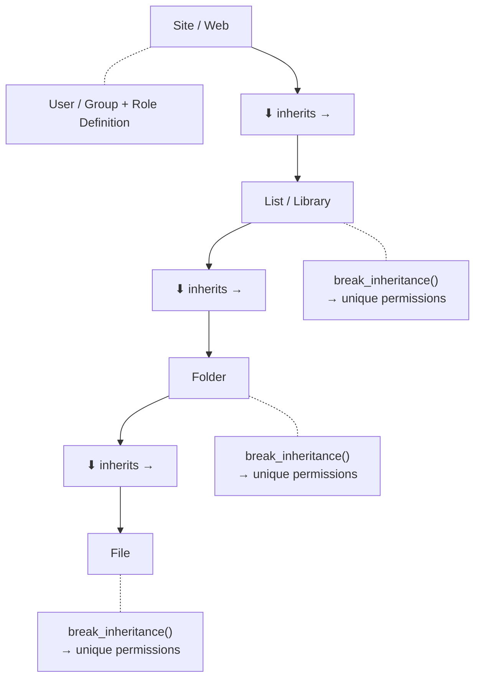

# Working with Permissions

Manage who can access what — at the site, list, folder, or file level.

---

## Prerequisites

| Requirement | Description | Reference |
|---|---|---|
| **Site Owner** role | Required to grant, revoke, or break inheritance. Read access for viewing permissions. | [SharePoint admin roles](https://learn.microsoft.com/en-us/sharepoint/sharepoint-admin-role) |

---

## How permissions work



Permissions flow **down** by default — a user with Read on the site gets Read on
every list, folder, and file. Use `break_role_inheritance()` to stop the flow
at any level and assign **unique permissions**.

### Role definitions

| Role | Permission level | Typical use |
|---|---|---|
| **Full Control** | All operations | Site owners, admins |
| **Edit** | Add, edit, delete; manage lists | Power users |
| **Contribute** | Add, edit, delete own items | Team members |
| **Read** | View only | Viewers, auditors |

---

## Examples

| Step | Operation | File | Required role | API reference |
|---|---|---|---|---|
| **1** | Get effective permissions — site | [`get_for_site.py`](./get_for_site.py) | Read access | [Permissions API](https://learn.microsoft.com/en-us/sharepoint/dev/apis/permissions-api-reference) |
| **2** | Get effective permissions — list | [`get_for_list.py`](./get_for_list.py) | Read access | [Permissions API](https://learn.microsoft.com/en-us/sharepoint/dev/apis/permissions-api-reference) |
| **3** | Get effective permissions — folder | [`get_for_folder.py`](./get_for_folder.py) | Read access | [Permissions API](https://learn.microsoft.com/en-us/sharepoint/dev/apis/permissions-api-reference) |
| **4** | Get effective permissions — file | [`get_for_file.py`](./get_for_file.py) | Read access | [Permissions API](https://learn.microsoft.com/en-us/sharepoint/dev/apis/permissions-api-reference) |
| **5** | List role definitions | [`get_role_definitions.py`](./get_role_definitions.py) | Read access | [Permissions API](https://learn.microsoft.com/en-us/sharepoint/dev/apis/permissions-api-reference) |
| **6** | Grant to site | [`grant_to_web.py`](./grant_to_web.py) | Site Owner | [Permissions API](https://learn.microsoft.com/en-us/sharepoint/dev/apis/permissions-api-reference) |
| **7** | Revoke from site | [`revoke_from_web.py`](./revoke_from_web.py) | Site Owner | [Permissions API](https://learn.microsoft.com/en-us/sharepoint/dev/apis/permissions-api-reference) |
| **8** | Grant to list | [`grant_to_list.py`](./grant_to_list.py) | Site Owner on target list | [Permissions API](https://learn.microsoft.com/en-us/sharepoint/dev/apis/permissions-api-reference) |
| **9** | Revoke from list | [`revoke_from_list.py`](./revoke_from_list.py) | Site Owner on target list | [Permissions API](https://learn.microsoft.com/en-us/sharepoint/dev/apis/permissions-api-reference) |
| **10** | Grant to folder | [`grant_to_folder.py`](./grant_to_folder.py) | Site Owner on target folder | [Permissions API](https://learn.microsoft.com/en-us/sharepoint/dev/apis/permissions-api-reference) |
| **11** | Revoke from folder | [`revoke_from_folder.py`](./revoke_from_folder.py) | Site Owner on target folder | [Permissions API](https://learn.microsoft.com/en-us/sharepoint/dev/apis/permissions-api-reference) |
| **12** | Break inheritance — list | [`break_inheritance.py`](./break_inheritance.py) | Site Owner on target list | [Permissions API](https://learn.microsoft.com/en-us/sharepoint/dev/apis/permissions-api-reference) |
| **13** | Break inheritance — folder | [`break_inheritance_folder.py`](./break_inheritance_folder.py) | Site Owner on target folder | [Permissions API](https://learn.microsoft.com/en-us/sharepoint/dev/apis/permissions-api-reference) |
| **14** | Reset inheritance — list | [`reset_inheritance.py`](./reset_inheritance.py) | Site Owner on target list | [Permissions API](https://learn.microsoft.com/en-us/sharepoint/dev/apis/permissions-api-reference) |

---

## Quick start

```python
from office365.sharepoint.client_context import ClientContext
from office365.sharepoint.sharing.role_type import RoleType

ctx = ClientContext("https://contoso.sharepoint.com/sites/team").with_client_secret(
    "contoso.onmicrosoft.com", "client_id", "client_secret"
)

# Get effective permissions on a list
target_list = ctx.web.default_document_library()
result = target_list.get_user_effective_permissions(ctx.web.current_user).execute_query()
for level in result.value.permission_levels:
    print(f"Permission: {level}")

# Grant a user Contributor access
target_list.add_role_assignment("user@contoso.com", RoleType.Contributor).execute_query()
```

---

## API reference

- [SharePoint permissions REST API](https://learn.microsoft.com/en-us/sharepoint/dev/apis/permissions-api-reference)
