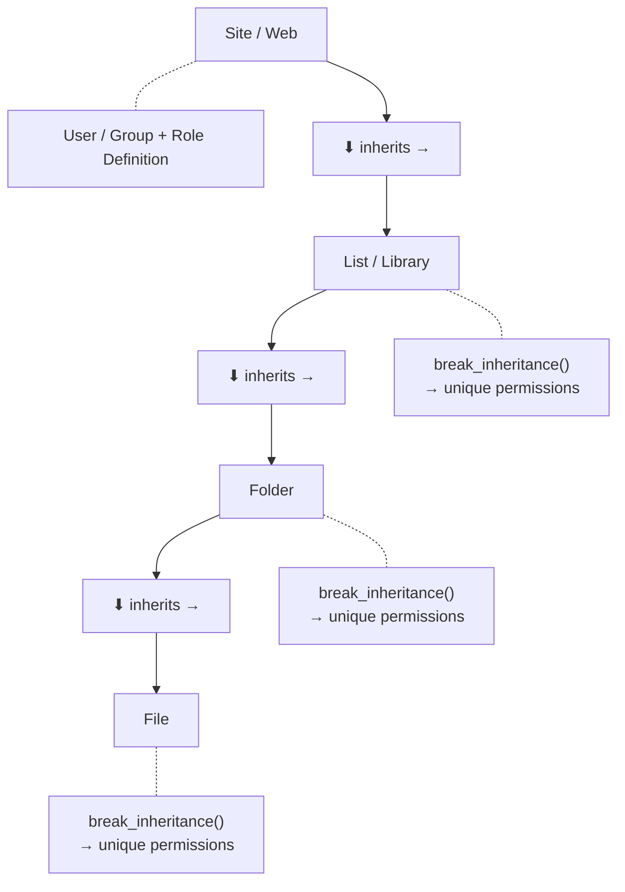

# Working with Permissions

Manage who can access what at the site, list, folder, or file level.

---

## Prerequisites

| Requirement | Description | Reference |
|---|---|---|
| **Site Owner** role | Required to grant, revoke, or break inheritance. Read access for viewing permissions. | [SharePoint admin roles](https://learn.microsoft.com/en-us/sharepoint/sharepoint-admin-role) |

---

## How permissions work


```mermaid
graph TD
    Site["Site / Web"]
    List["List / Library"]
    Folder["Folder"]
    File["File"]
    Role["User / Group + Role Definition"]
    Inherit1["⬇ inherits →"]
    Inherit2["⬇ inherits →"]
    Inherit3["⬇ inherits →"]

    Site --> Inherit1
    Inherit1 --> List
    List --> Inherit2
    Inherit2 --> Folder
    Folder --> Inherit3
    Inherit3 --> File

    Site -.- Role
    List -.- Break1["break_inheritance()\n→ unique permissions"]
    Folder -.- Break2["break_inheritance()\n→ unique permissions"]
    File -.- Break3["break_inheritance()\n→ unique permissions"]
```

Permissions flow **down** by default. A user with Read on the site gets Read on
every list, folder, and file. Use `break_role_inheritance()` to stop the flow
at any level and assign **unique permissions**.

### Role definitions

| Role | Permission level | Typical use |
|---|---|---|
| **Full Control** | All operations | Site owners, admins |
| **Edit** | Add, edit, delete; manage lists | Power users |
| **Contribute** | Add, edit, delete own items | Team members |
| **Read** | View only | Viewers, auditors |

---

## Examples

### Lifecycle

Each script operates on a `--scope site|list|folder|file` (folder/file go
through their list-item facet; `break`/`reset` support site/list/folder):

```bash
python examples/sharepoint/permissions/grant_permission.py --scope site --principal user@contoso.com --role read
python examples/sharepoint/permissions/grant_permission.py --scope list --list "Documents" --principal user@contoso.com --role contribute
python examples/sharepoint/permissions/grant_permission.py --scope folder --url "/sites/team/Shared Documents/Reports" --principal user@contoso.com --role read
python examples/sharepoint/permissions/revoke_permission.py --scope list --list "Documents" --principal user@contoso.com --role contribute
python examples/sharepoint/permissions/break_inheritance.py --scope list --list "Documents" [--copy] [--clear-subscopes]
python examples/sharepoint/permissions/reset_inheritance.py --scope folder --url "/sites/team/Shared Documents/Reports"
python examples/sharepoint/permissions/effective_permissions.py --scope site [--principal user@contoso.com]
```

| Operation | File | Required role |
|---|---|---|
| Grant a role (site / list / folder / file) | [`grant_permission.py`](./grant_permission.py) | Site Owner |
| Revoke a role (site / list / folder / file) | [`revoke_permission.py`](./revoke_permission.py) | Site Owner |
| Break inheritance (site / list / folder) | [`break_inheritance.py`](./break_inheritance.py) | Site Owner |
| Reset inheritance (site / list / folder) | [`reset_inheritance.py`](./reset_inheritance.py) | Site Owner |
| Check effective permissions | [`effective_permissions.py`](./effective_permissions.py) | Read access |
| List role definitions | [`get_role_definitions.py`](./get_role_definitions.py) | Read access |
| Create a custom role definition | [`create_role_definition.py`](./create_role_definition.py) | Site Owner |

### Reporting

| Operation | File | Required role |
|---|---|---|
| Role-assignment inventory (site + lists) | [`permissions_report.py`](./permissions_report.py) | Read access / `Sites.FullControl.All` |
| Folder permissions report (unique permissions) | [`folder_permissions_report.py`](./folder_permissions_report.py) | Site Owner + `Sites.FullControl.All` |

---

## Quick start

```python
from office365.sharepoint.client_context import ClientContext
from office365.sharepoint.sharing.role_type import RoleType

ctx = ClientContext("https://contoso.sharepoint.com/sites/team").with_client_secret(
    "contoso.onmicrosoft.com", "client_id", "client_secret"
)

# Get effective permissions on a list
target_list = ctx.web.default_document_library()
result = target_list.get_user_effective_permissions(ctx.web.current_user).execute_query()
for level in result.value.permission_levels:
    print(f"Permission: {level}")

# Grant a user Contributor access
target_list.add_role_assignment("user@contoso.com", RoleType.Contributor).execute_query()
```

---

## API reference

- [SharePoint permissions REST API](https://learn.microsoft.com/en-us/sharepoint/dev/apis/permissions-api-reference)
