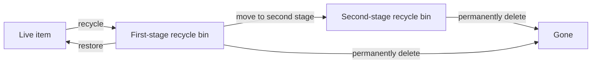

# Recycle Bin

List, restore, recycle, and permanently delete items in the SharePoint recycle bin.

## Lifecycle



## Prerequisites

| Requirement | Description | Reference |
|---|---|---|
| **Read access** to the site | Required to view the recycle bin | [SharePoint admin roles](https://learn.microsoft.com/en-us/sharepoint/sharepoint-admin-role) |
| **Site Owner** role | Required to restore, move to second stage, and permanently delete items | [SharePoint admin roles](https://learn.microsoft.com/en-us/sharepoint/sharepoint-admin-role) |

## Examples

| Operation | File | Required role | API reference |
|---|---|---|---|
| Recycle a list item (send to recycle bin) | [`recycle_item.py`](./recycle_item.py) | Edit items | [Recycle bin REST API](https://learn.microsoft.com/en-us/sharepoint/dev/apis/rest-api) |
| List recycle bin items (first or second stage) | [`list_recycle_bin.py`](./list_recycle_bin.py) | Read access | [Recycle bin REST API](https://learn.microsoft.com/en-us/sharepoint/dev/apis/rest-api) |
| Restore an item (or all) from the recycle bin | [`restore_from_recycle_bin.py`](./restore_from_recycle_bin.py) | Site Owner | [Recycle bin REST API](https://learn.microsoft.com/en-us/sharepoint/dev/apis/rest-api) |
| Move items to the second-stage recycle bin | [`move_to_second_stage.py`](./move_to_second_stage.py) | Site Owner | [Recycle bin REST API](https://learn.microsoft.com/en-us/sharepoint/dev/apis/rest-api) |
| Permanently delete items (first or second stage) | [`permanent_delete.py`](./permanent_delete.py) | Site Owner | [Recycle bin REST API](https://learn.microsoft.com/en-us/sharepoint/dev/apis/rest-api) |

## Quick start

```python
from office365.sharepoint.client_context import ClientContext

ctx = ClientContext("https://contoso.sharepoint.com/sites/team").with_client_secret(
    "contoso.onmicrosoft.com", "client_id", "client_secret"
)

# List first-stage recycle bin items
items = ctx.web.recycle_bin.get().execute_query()
for item in items:
    print(f"  {item.title}  (deleted: {item.deleted_date})")

# Restore the most recently deleted item
if len(items):
    items[0].restore().execute_query()
```

## API reference

- [SharePoint REST API](https://learn.microsoft.com/en-us/sharepoint/dev/apis/rest-api)
