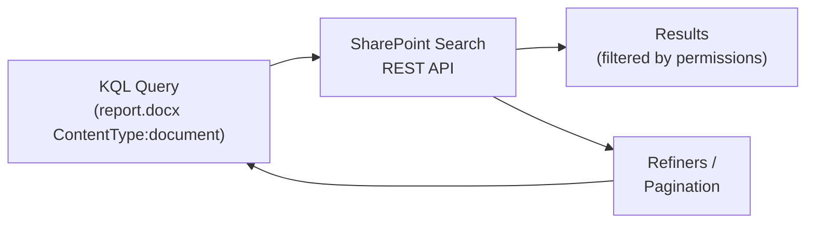

# Searching SharePoint

Use the SharePoint search REST API to find sites, documents, and list items
across the tenant. Queries use **Keyword Query Language (KQL)** with
property filters, refiners, and sort orders.

---

## Prerequisites

| Requirement | Description | Reference |
|---|---|---|
| **Read access** to the content being searched | Search results respect item-level permissions. Users only see what they can access. | [SharePoint admin roles](https://learn.microsoft.com/en-us/sharepoint/sharepoint-admin-role) |

---

## How search works



Search queries are sent to the `/_api/search/query` endpoint as KQL text.
Results respect the requesting user's permissions — you only see what you
have access to.

### Common KQL filters

| Filter | Example | Description |
|---|---|---|
| `IsDocument:1` | `project report IsDocument:1` | Files only |
| `contentclass:STS_Site` | `contentclass:STS_Site` | Sites only |
| `Path:` | `Path:https://contoso.sharepoint.com/sites/team` | Restrict scope |
| `ContentType:` | `ContentType:invoice` | Filter by content type |
| `Author:` | `Author:"Vadim G"` | Filter by author |
| `LastModifiedTime:` | `LastModifiedTime>2026-01-01` | Date range |

---

## Examples

| Step | Operation | File | Required role | API reference |
|---|---|---|---|---|
| **1** | Keyword search — simple text query across all content | [`query_keyword.py`](./query_keyword.py) | Read access to content | [Search REST API](https://learn.microsoft.com/en-us/sharepoint/dev/general-development/sharepoint-search-rest-api-overview) |
| **2** | Search documents — scope to files (`IsDocument:1`) | [`query_documents.py`](./query_documents.py) | Read access to libraries | [Search REST API](https://learn.microsoft.com/en-us/sharepoint/dev/general-development/sharepoint-search-rest-api-overview) |
| **3** | Search sites — enumerate accessible sites | [`query_sites.py`](./query_sites.py) | Read access to sites | [Search REST API](https://learn.microsoft.com/en-us/sharepoint/dev/general-development/sharepoint-search-rest-api-overview) |
| **4** | Search by site — limit scope with `Path:` | [`query_by_site.py`](./query_by_site.py) | Read access to content | [Search REST API](https://learn.microsoft.com/en-us/sharepoint/dev/general-development/sharepoint-search-rest-api-overview) |
| **5** | Search by content type — filter with `ContentType:` | [`query_by_content_type.py`](./query_by_content_type.py) | Read access to content | [Search REST API](https://learn.microsoft.com/en-us/sharepoint/dev/general-development/sharepoint-search-rest-api-overview) |
| **6** | Search with filters — author and date-range KQL | [`query_with_filter.py`](./query_with_filter.py) | Read access to content | [Search REST API](https://learn.microsoft.com/en-us/sharepoint/dev/general-development/sharepoint-search-rest-api-overview) |
| **7** | Search with sorting — ordered by managed property | [`query_with_sort.py`](./query_with_sort.py) | Read access to content | [Search REST API](https://learn.microsoft.com/en-us/sharepoint/dev/general-development/sharepoint-search-rest-api-overview) |
| **8** | Search with refinement — faceted drill-down | [`query_with_refinement.py`](./query_with_refinement.py) | Read access to content | [Search REST API](https://learn.microsoft.com/en-us/sharepoint/dev/general-development/sharepoint-search-rest-api-overview) |
| **9** | Search with pagination — page through large results | [`query_paged.py`](./query_paged.py) | Read access to content | [Search REST API](https://learn.microsoft.com/en-us/sharepoint/dev/general-development/sharepoint-search-rest-api-overview) |
| **10** | Export search reports — tenant-level usage | [`export_reports.py`](./export_reports.py) | Search admin | [Search REST API](https://learn.microsoft.com/en-us/sharepoint/dev/general-development/sharepoint-search-rest-api-overview) |

---

## Quick start

```python
from office365.sharepoint.client_context import ClientContext

ctx = ClientContext("https://contoso.sharepoint.com/sites/team").with_client_secret(
    "contoso.onmicrosoft.com", "client_id", "client_secret"
)

# Simple keyword search for documents
result = ctx.search.query("project report IsDocument:1").execute_query()
for row in result.value:
    print(f"  {row.get('Title', '')}  ({row.get('Path', '')})")
```

---

## API reference

- [SharePoint search REST API overview](https://learn.microsoft.com/en-us/sharepoint/dev/general-development/sharepoint-search-rest-api-overview)
- [Keyword Query Language (KQL) syntax](https://learn.microsoft.com/en-us/sharepoint/dev/general-development/keyword-query-language-kql-syntax-reference)
