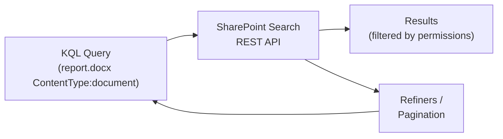

# Searching SharePoint

Use the SharePoint search REST API to find sites, documents, people, and list items
across the tenant. Queries use **Keyword Query Language (KQL)** with property
filters, refiners, sort orders, suggestions, and pagination.

---

## Prerequisites

| Requirement | Description | Reference |
|---|---|---|
| **Read access** to the content being searched | Search results respect item-level permissions. Users only see what they can access. | [SharePoint admin roles](https://learn.microsoft.com/en-us/sharepoint/sharepoint-admin-role) |
| **Sites.ReadWrite.All** | Required for the admin examples | [SharePoint admin roles](https://learn.microsoft.com/en-us/sharepoint/sharepoint-admin-role) |

---

## How search works


```mermaid
flowchart LR
    Query["KQL Query\n(report.docx ContentType:document)"]
    SearchAPI["SharePoint Search\nREST API"]
    Results["Results\n(filtered by permissions)"]
    Refinement["Refiners /\nPagination"]

    Query --> SearchAPI
    SearchAPI --> Results
    SearchAPI --> Refinement
    Refinement --> Query
```

Search queries are sent to the `/_api/search/query` endpoint as KQL text.
Results respect the requesting user's permissions.

### Common KQL filters

| Filter | Example | Description |
|---|---|---|
| `IsDocument:1` | `project report IsDocument:1` | Files only |
| `contentclass:STS_Site` | `contentclass:STS_Site` | Sites only |
| `contentclass:SP.People` | `contentclass:SP.People Smith` | People only |
| `Path:` | `Path:https://...` | Restrict scope |
| `ContentType:` | `ContentType:invoice` | Filter by content type |
| `Author:` | `Author:"Vadim G"` | Filter by author |
| `LastModifiedTime:` | `LastModifiedTime>2026-01-01` | Date range |

---

## Examples

### Query

| Operation | File | Required role | API reference |
|---|---|---|---|
| Keyword search | [`query_keyword.py`](./query_keyword.py) | Read access to content | [Search REST API](https://learn.microsoft.com/en-us/sharepoint/dev/general-development/sharepoint-search-rest-api-overview) |
| Search documents (IsDocument) | [`query_documents.py`](./query_documents.py) | Read access to libraries | [Search REST API](https://learn.microsoft.com/en-us/sharepoint/dev/general-development/sharepoint-search-rest-api-overview) |
| Search sites (contentclass) | [`query_sites.py`](./query_sites.py) | Read access to sites | [Search REST API](https://learn.microsoft.com/en-us/sharepoint/dev/general-development/sharepoint-search-rest-api-overview) |
| Search people (contentclass) | [`query_people.py`](./query_people.py) | Read access to people | [Search REST API](https://learn.microsoft.com/en-us/sharepoint/dev/general-development/sharepoint-search-rest-api-overview) |
| Search by site (Path:) | [`query_by_site.py`](./query_by_site.py) | Read access to content | [Search REST API](https://learn.microsoft.com/en-us/sharepoint/dev/general-development/sharepoint-search-rest-api-overview) |
| Search by content type | [`query_by_content_type.py`](./query_by_content_type.py) | Read access to content | [Search REST API](https://learn.microsoft.com/en-us/sharepoint/dev/general-development/sharepoint-search-rest-api-overview) |
| Filter by author / date range | [`query_with_filter.py`](./query_with_filter.py) | Read access to content | [Search REST API](https://learn.microsoft.com/en-us/sharepoint/dev/general-development/sharepoint-search-rest-api-overview) |
| Sort by managed property | [`query_with_sort.py`](./query_with_sort.py) | Read access to content | [Search REST API](https://learn.microsoft.com/en-us/sharepoint/dev/general-development/sharepoint-search-rest-api-overview) |
| Refinement / faceted drill-down | [`query_with_refinement.py`](./query_with_refinement.py) | Read access to content | [Search REST API](https://learn.microsoft.com/en-us/sharepoint/dev/general-development/sharepoint-search-rest-api-overview) |
| Suggestions and auto-completion | [`query_suggestions.py`](./query_suggestions.py) | Read access to content | [Search REST API](https://learn.microsoft.com/en-us/sharepoint/dev/general-development/sharepoint-search-rest-api-overview) |
| Paginate through results | [`query_paged.py`](./query_paged.py) | Read access to content | [Search REST API](https://learn.microsoft.com/en-us/sharepoint/dev/general-development/sharepoint-search-rest-api-overview) |
| Export results to CSV | [`export_results.py`](./export_results.py) | Read access to content | [Search REST API](https://learn.microsoft.com/en-us/sharepoint/dev/general-development/sharepoint-search-rest-api-overview) |

### Administration

| Operation | File | Required role | API reference |
|---|---|---|---|
| Crawl diagnostics, popular queries, suggestions | [`admin/diagnostics.py`](./admin/diagnostics.py) | Sites.ReadWrite.All | [Search REST API](https://learn.microsoft.com/en-us/sharepoint/dev/general-development/search-in-sharepoint) |
| Query configuration and promoted results | [`admin/query_configuration.py`](./admin/query_configuration.py) | Sites.ReadWrite.All | [Search REST API](https://learn.microsoft.com/en-us/sharepoint/dev/general-development/search-in-sharepoint) |
| Export search reports | [`export_reports.py`](./export_reports.py) | Search admin | [Search REST API](https://learn.microsoft.com/en-us/sharepoint/dev/general-development/sharepoint-search-rest-api-overview) |

---

## Quick start

```python
from office365.sharepoint.client_context import ClientContext

ctx = ClientContext("https://contoso.sharepoint.com/sites/team").with_client_secret(
    "contoso.onmicrosoft.com", "client_id", "client_secret"
)

# Search for documents
result = ctx.search.post_query("IsDocument:1", row_limit=10).execute_query()
rows = result.value.PrimaryQueryResult.RelevantResults.Table.Rows
for row in rows:
    print(f"  {row.Cells['Path']}")
```

---

## API reference

- [SharePoint search REST API overview](https://learn.microsoft.com/en-us/sharepoint/dev/general-development/sharepoint-search-rest-api-overview)
- [Keyword Query Language (KQL) syntax](https://learn.microsoft.com/en-us/sharepoint/dev/general-development/keyword-query-language-kql-syntax-reference)
