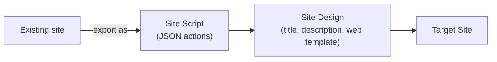

# Site Designs

**Site designs** bundle one or more **site scripts** into a packaged template
that can be applied to new or existing sites. They automate site provisioning
with consistent theme, navigation, lists, and settings.

---

## Prerequisites

| Requirement | Description | Reference |
|---|---|---|
| **Site Owner** or **SharePoint Administrator** role | Required to create, update, and delete site designs. | [SharePoint admin roles](https://learn.microsoft.com/en-us/sharepoint/sharepoint-admin-role) |

---

## How site designs work



A site design references one or more site scripts. When applied, the scripts
run in order on the target site. Site scripts define the actual JSON actions
(theme, navigation, lists, etc.), while the site design itself is just the
packaging metadata.

> Site scripts are created and managed under
> [`examples/sharepoint/sitescripts/`](../sitescripts/).

---

## Examples

| Step | Operation | File | Required role | API reference |
|---|---|---|---|---|
| **1** | List: enumerate all site designs | [`list_designs.py`](./list_designs.py) | Read access | [Site design REST API](https://learn.microsoft.com/en-us/sharepoint/dev/declarative-customization/site-design-rest-api) |
| **2** | Get: get metadata for a specific design | [`get_design.py`](./get_design.py) | Read access | [Site design REST API](https://learn.microsoft.com/en-us/sharepoint/dev/declarative-customization/site-design-rest-api) |
| **3** | Create: create site script and bundle into a design | [`create_design.py`](./create_design.py) | Site Owner | [Site design REST API](https://learn.microsoft.com/en-us/sharepoint/dev/declarative-customization/site-design-rest-api) |
| **4** | Update: change title, description, or linked scripts | [`update_design.py`](./update_design.py) | Site Owner | [Site design REST API](https://learn.microsoft.com/en-us/sharepoint/dev/declarative-customization/site-design-rest-api) |
| **5** | Delete: remove a site design | [`delete_design.py`](./delete_design.py) | Site Owner | [Site design REST API](https://learn.microsoft.com/en-us/sharepoint/dev/declarative-customization/site-design-rest-api) |
| **6** | Design from web: export a live site into a script and design | [`design_from_web.py`](./design_from_web.py) | Read access on source site | [Site design REST API](https://learn.microsoft.com/en-us/sharepoint/dev/declarative-customization/site-design-rest-api) |
| **7** | Apply: apply a design asynchronously to a site | [`apply_design.py`](./apply_design.py) | Site Owner on target | [Site design REST API](https://learn.microsoft.com/en-us/sharepoint/dev/declarative-customization/site-design-rest-api) |
| **8** | Grant rights: grant or revoke access to a design | [`grant_rights.py`](./grant_rights.py) | Site Owner | [Site design REST API](https://learn.microsoft.com/en-us/sharepoint/dev/declarative-customization/site-design-rest-api) |

---

## Quick start

```python
from office365.sharepoint.client_context import ClientContext

ctx = ClientContext("https://contoso-admin.sharepoint.com").with_client_secret(
    "contoso.onmicrosoft.com", "client_id", "client_secret"
)

from office365.sharepoint.sitedesigns.utility import SiteDesignUtility

# List all site designs
designs = SiteDesignUtility.get_site_designs(ctx).execute_query()
for d in designs.value:
    print(f"  {d.Title}  (ID: {d.Id})")

# Apply a design to a site
SiteDesignUtility.apply_site_design(ctx, design_id, site_url).execute_query()
```

---

## API reference

- [Site design REST API](https://learn.microsoft.com/en-us/sharepoint/dev/declarative-customization/site-design-rest-api)
- [Site design overview](https://learn.microsoft.com/en-us/sharepoint/dev/declarative-customization/site-design-overview)
- [Site design JSON schema](https://learn.microsoft.com/en-us/sharepoint/dev/declarative-customization/site-design-json-schema)
- [Site scripts (examples)](../sitescripts/)
