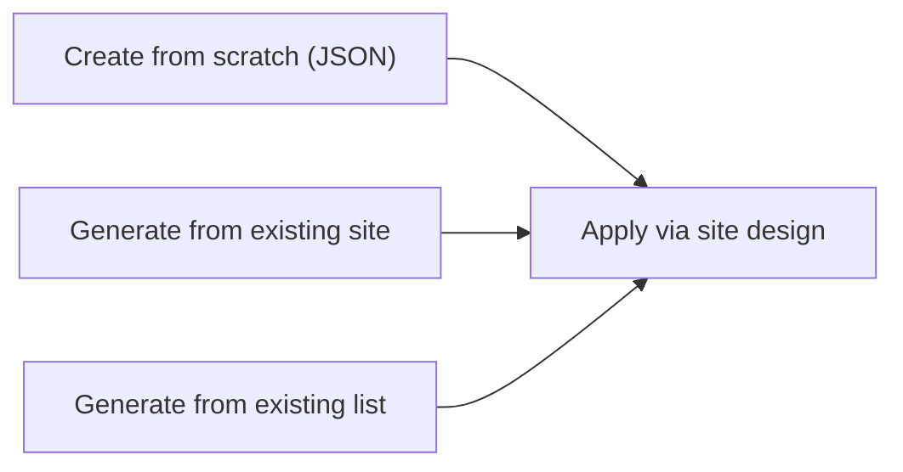

# Site Scripts

Create, inspect, and manage SharePoint site scripts — JSON-based provisioning
recipes that automate site configuration (themes, lists, settings, etc.).

Site scripts are used together with **site designs** to standardize site
creation across a tenant.

---

## Prerequisites

| Requirement | Description | Reference |
|---|---|---|
| **Site Owner** or **SharePoint Administrator** role | Required to create and manage site scripts. | [SharePoint admin roles](https://learn.microsoft.com/en-us/sharepoint/sharepoint-admin-role) |

---

## How site scripts work



Site scripts can be **authored manually** as a JSON action list or **generated**
from an existing site or list. They're then referenced by a site design
which runs them when a site is provisioned.

---

## Examples

| Step | Operation | File | Required role | API reference |
|---|---|---|---|---|
| **1** | List — enumerate all site scripts in the tenant | [`list_scripts.py`](./list_scripts.py) | Read access | [Get site scripts](https://learn.microsoft.com/en-us/sharepoint/dev/declarative-customization/site-design-overview) |
| **2** | Create — create a site script from a JSON action list | [`create.py`](./create.py) | Site Owner | [Create site script](https://learn.microsoft.com/en-us/sharepoint/dev/declarative-customization/site-design-overview) |
| **3** | Generate from site — export an existing site as a script | [`get_from_web.py`](./get_from_web.py) | Read access on source site | [Get from web](https://learn.microsoft.com/en-us/sharepoint/dev/declarative-customization/site-design-overview) |
| **4** | Generate from list — export an existing list as a script | [`get_from_list.py`](./get_from_list.py) | Read access on source list | [Get from list](https://learn.microsoft.com/en-us/sharepoint/dev/declarative-customization/site-design-overview) |
| **5** | Delete — remove a site script by ID | [`delete_script.py`](./delete_script.py) | Site Owner | [Delete site script](https://learn.microsoft.com/en-us/sharepoint/dev/declarative-customization/site-design-overview) |

---

## Quick start

```python
from office365.sharepoint.client_context import ClientContext

ctx = ClientContext("https://contoso.sharepoint.com/sites/team").with_client_secret(
    "contoso.onmicrosoft.com", "client_id", "client_secret"
)

# List existing site scripts
from office365.sharepoint.sitescripts.utility import SiteScriptUtility

result = SiteScriptUtility.get_site_scripts(ctx).execute_query()
for s in result.value:
    print(f"  {s.Title}  (ID: {s.Id})")

# Create a script that applies a custom theme
site_script = {
    "$schema": "schema.json",
    "actions": [{"verb": "applyTheme", "themeName": "Contoso Theme"}],
    "bindata": {},
    "version": 1,
}
created = SiteScriptUtility.create_site_script(
    ctx, "Theme Script", "Applies Contoso theme", site_script
).execute_query()
print(f"Created: {created.value.Title} (ID: {created.value.Id})")
```

---

## API reference

- [Site design and site script REST API](https://learn.microsoft.com/en-us/sharepoint/dev/declarative-customization/site-design-rest-api)
- [Site design overview](https://learn.microsoft.com/en-us/sharepoint/dev/declarative-customization/site-design-overview)