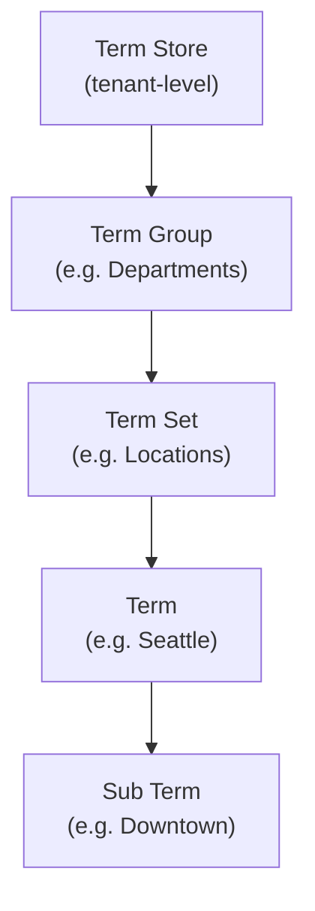

# Taxonomy (Managed Metadata)

SharePoint's managed metadata system for consistent tagging across sites
using hierarchical term stores, term groups, term sets, and terms.

---

## Prerequisites

| Requirement | Description | Reference |
|---|---|---|
| **Read access** to the term store | Required to browse terms. **Term Store Administrator** role to create groups and term sets. | [SharePoint admin roles](https://learn.microsoft.com/en-us/sharepoint/sharepoint-admin-role) |

---

## How taxonomy is structured



The **Term Store** is the root, accessed via `TaxonomyService`. It contains
groups, which contain term sets, which contain terms (which can nest).

---

## Examples

### Explore the term store

| Step | Operation | File | Required role | API reference |
|---|---|---|---|---|
| **1** | Get term store info | [`get_term_store_info.py`](./get_term_store_info.py) | Read access | [Taxonomy REST API](https://learn.microsoft.com/en-us/sharepoint/dev/apis/rest-api) |
| **2** | Get a term group by name | [`get_group_by_name.py`](./get_group_by_name.py) | Read access | [Taxonomy REST API](https://learn.microsoft.com/en-us/sharepoint/dev/apis/rest-api) |
| **3** | Get a term set | [`get_term_set.py`](./get_term_set.py) | Read access | [Taxonomy REST API](https://learn.microsoft.com/en-us/sharepoint/dev/apis/rest-api) |
| **4** | Get a term by ID | [`get_term_by_id.py`](./get_term_by_id.py) | Read access | [Taxonomy REST API](https://learn.microsoft.com/en-us/sharepoint/dev/apis/rest-api) |
| **5** | Search terms | [`search_term.py`](./search_term.py) | Read access | [Taxonomy REST API](https://learn.microsoft.com/en-us/sharepoint/dev/apis/rest-api) |
| **6** | Export term store to file | [`export_term_store.py`](./export_term_store.py) | Read access | [Taxonomy REST API](https://learn.microsoft.com/en-us/sharepoint/dev/apis/rest-api) |

### Taxonomy fields

| Step | Operation | File | Required role | API reference |
|---|---|---|---|---|
| **7** | Create taxonomy field on a list | [`create_field.py`](./create_field.py) | Member on list | [Taxonomy REST API](https://learn.microsoft.com/en-us/sharepoint/dev/apis/rest-api) |
| **8** | Get taxonomy field value | [`get_field_value.py`](./get_field_value.py) | Read access | [Taxonomy REST API](https://learn.microsoft.com/en-us/sharepoint/dev/apis/rest-api) |
| **9** | Set taxonomy field value | [`set_field_value.py`](./set_field_value.py) | Contribute on item | [Taxonomy REST API](https://learn.microsoft.com/en-us/sharepoint/dev/apis/rest-api) |

---

## Quick start

```python
from office365.sharepoint.client_context import ClientContext
from office365.sharepoint.taxonomy.service import TaxonomyService

ctx = ClientContext("https://contoso.sharepoint.com/sites/team").with_client_secret(
    "contoso.onmicrosoft.com", "client_id", "client_secret"
)

# Access the term store
tax_service = TaxonomyService(ctx)
store = tax_service.term_stores.get().execute_query()
print(f"Term Store: {store.name}  (default language: {store.default_language})")

# List term groups
for group in store.groups:
    print(f"  Group: {group.name}")
```

---

## API reference

- [SharePoint taxonomy REST API](https://learn.microsoft.com/en-us/sharepoint/dev/apis/rest-api)
