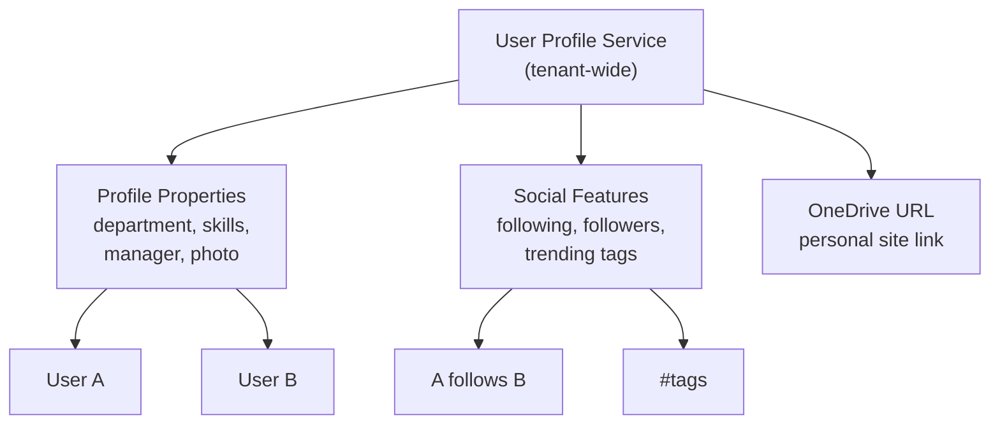

# User Profiles

Interact with SharePoint user profiles via the **User Profile Service** —
view profile properties, manage followers, explore social features, and
access OneDrive URLs.

---

## Prerequisites

| Requirement | Description | Reference |
|---|---|---|
| **Read access** to user profiles | Required to view profile properties. User context needed for follow/social features. | [SharePoint admin roles](https://learn.microsoft.com/en-us/sharepoint/sharepoint-admin-role) |

---

## How the User Profile Service works



The **User Profile Service** is a tenant-level service that stores user
metadata separately from site permissions. It is accessed via
`ctx.people_manager` for profile properties and social operations.

---

## Examples

### Profile properties

| Step | Operation | File | Required role | API reference |
|---|---|---|---|---|
| **1** | Get profile properties | [`get_properties.py`](./get_properties.py) | Read access | [People REST API](https://learn.microsoft.com/en-us/sharepoint/dev/apis/people-rest-api) |
| **2** | Export profiles for all users | [`export.py`](./export.py) | Read access | [People REST API](https://learn.microsoft.com/en-us/sharepoint/dev/apis/people-rest-api) |
| **3** | Get trending tags | [`get_trending_tags.py`](./get_trending_tags.py) | Read access | [People REST API](https://learn.microsoft.com/en-us/sharepoint/dev/apis/people-rest-api) |
| **4** | Get OneDrive URL | [`get_onedrive_url.py`](./get_onedrive_url.py) | Read access | [People REST API](https://learn.microsoft.com/en-us/sharepoint/dev/apis/people-rest-api) |

### Social (following)

| Step | Operation | File | Required role | API reference |
|---|---|---|---|---|
| **5** | Follow or unfollow a user | [`follow_user.py`](./follow_user.py) | User context | [People REST API](https://learn.microsoft.com/en-us/sharepoint/dev/apis/people-rest-api) |
| **6** | Check if following a user | [`am_i_following.py`](./am_i_following.py) | User context | [People REST API](https://learn.microsoft.com/en-us/sharepoint/dev/apis/people-rest-api) |
| **7** | Get my followers | [`get_my_followers.py`](./get_my_followers.py) | User context | [People REST API](https://learn.microsoft.com/en-us/sharepoint/dev/apis/people-rest-api) |
| **8** | Get people I follow | [`get_people_followed_by.py`](./get_people_followed_by.py) | User context | [People REST API](https://learn.microsoft.com/en-us/sharepoint/dev/apis/people-rest-api) |
| **9** | Get followers of a specific user | [`get_followers.py`](./get_followers.py) | User context | [People REST API](https://learn.microsoft.com/en-us/sharepoint/dev/apis/people-rest-api) |

---

## Quick start

```python
from office365.sharepoint.client_context import ClientContext

ctx = ClientContext("https://contoso.sharepoint.com/sites/team").with_client_secret(
    "contoso.onmicrosoft.com", "client_id", "client_secret"
)

# Get current user's profile properties
props = ctx.people_manager.get_properties_for(ctx.web.current_user.login_name).execute_query()
print(f"Display name: {props.display_name}")
print(f"Department: {props.department}")
print(f"Skills: {props.skills}")

# Get trending tags
tags = ctx.people_manager.get_trending_tags().execute_query()
for tag in tags.value:
    print(f"  #{tag.name}  ({tag.count})")
```

---

## API reference

- [SharePoint People REST API](https://learn.microsoft.com/en-us/sharepoint/dev/apis/people-rest-api)
