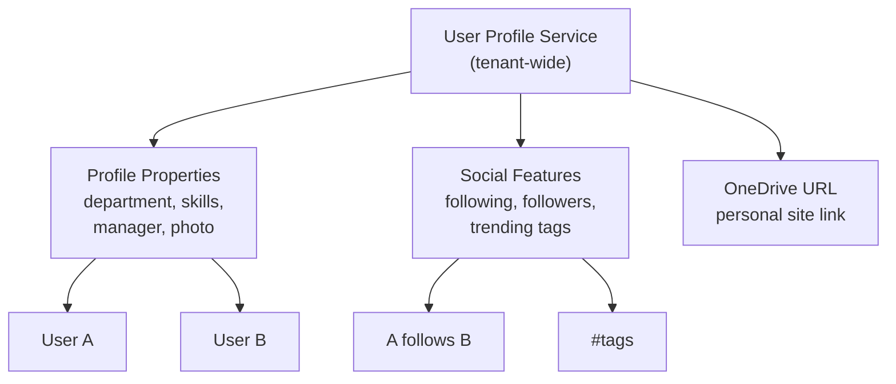

# User Profiles

Interact with SharePoint user profiles via the **User Profile Service**:
view profile properties, manage followers, explore social features, and
access OneDrive URLs.

---

## Prerequisites

| Requirement | Description | Reference |
|---|---|---|
| **Read access** to user profiles | Required to view profile properties. User context needed for follow/social features. | [SharePoint admin roles](https://learn.microsoft.com/en-us/sharepoint/sharepoint-admin-role) |

---

## How the User Profile Service works


```mermaid
graph TD
    site["User Profile Service\n(tenant-wide)"]
    props["Profile Properties\ndepartment, skills,\nmanager, photo"]
    social["Social Features\nfollowing, followers,\ntrending tags"]
    onedrive["OneDrive URL\npersonal site link"]

    site --> props
    site --> social
    site --> onedrive
    props --> user["User A"]
    props --> user2["User B"]
    social --> follows["A follows B"]
    social --> trending["#tags"]
```

The **User Profile Service** is a tenant-level service that stores user
metadata separately from site permissions. It is accessed via
`ctx.people_manager` for profile properties, social operations, and
profile picture / property updates.

---

## Examples

### Profile properties

| Operation | File | Required role | API reference |
|---|---|---|---|
| Get profile properties (readable summary) | [`get_properties.py`](./get_properties.py) | Read access | [People REST API](https://learn.microsoft.com/en-us/sharepoint/dev/apis/people-rest-api) |
| Export curated profile properties to CSV | [`export.py`](./export.py) | Read access | [People REST API](https://learn.microsoft.com/en-us/sharepoint/dev/apis/people-rest-api) |
| Set a profile property (single / multi-valued) | [`set_profile_property.py`](./set_profile_property.py) | Manage profiles | [People REST API](https://learn.microsoft.com/en-us/sharepoint/dev/apis/people-rest-api) |
| Set the current user's profile picture | [`set_profile_picture.py`](./set_profile_picture.py) | Manage profiles | [People REST API](https://learn.microsoft.com/en-us/sharepoint/dev/apis/people-rest-api) |
| Get trending tags | [`get_trending_tags.py`](./get_trending_tags.py) | Read access | [People REST API](https://learn.microsoft.com/en-us/sharepoint/dev/apis/people-rest-api) |
| Get the OneDrive URL for a user | [`get_onedrive_url.py`](./get_onedrive_url.py) | Read access | [People REST API](https://learn.microsoft.com/en-us/sharepoint/dev/apis/people-rest-api) |

### Social (following)

| Operation | File | Required role | API reference |
|---|---|---|---|
| List followers / people followed | [`followers.py`](./followers.py) | User context | [People REST API](https://learn.microsoft.com/en-us/sharepoint/dev/apis/people-rest-api) |
| Follow or unfollow a user | [`follow_user.py`](./follow_user.py) | User context | [People REST API](https://learn.microsoft.com/en-us/sharepoint/dev/apis/people-rest-api) |
| Check if following a user | [`am_i_following.py`](./am_i_following.py) | User context | [People REST API](https://learn.microsoft.com/en-us/sharepoint/dev/apis/people-rest-api) |

---

## Quick start

```python
from office365.sharepoint.client_context import ClientContext

ctx = ClientContext("https://contoso.sharepoint.com/sites/team").with_client_secret(
    "contoso.onmicrosoft.com", "client_id", "client_secret"
)

# Get current user's profile properties
props = ctx.people_manager.get_properties_for(ctx.web.current_user).execute_query()
print(f"Display name: {props.display_name}")
print(f"Department: {props.department}")
print(f"Skills: {props.skills}")

# Get trending tags (note: the API takes the context)
tags = ctx.people_manager.get_trending_tags(ctx).execute_query()
for tag in tags.items:
    print(f"  #{tag.name}  ({tag.count})")
```

---

## API reference

- [SharePoint People REST API](https://learn.microsoft.com/en-us/sharepoint/dev/apis/people-rest-api)
