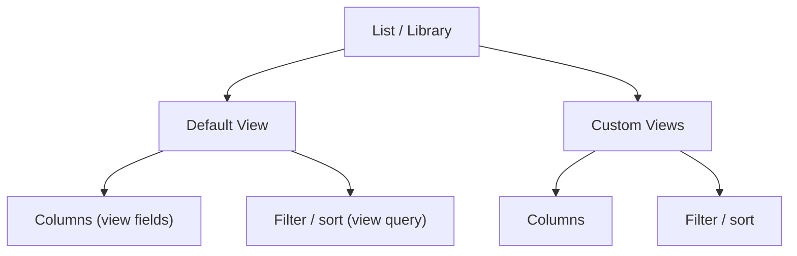

# Views

A **view** defines how a list or library is displayed: which columns to show,
the sort order, filters, and grouping. Every list has a **default view** and
can have many **custom views**.

---

## Prerequisites

| Requirement | Description | Reference |
|---|---|---|
| **Read access** to the list | Required to read views. **Member** role on list to create/update/delete views. | [SharePoint admin roles](https://learn.microsoft.com/en-us/sharepoint/sharepoint-admin-role) |

---

## How views work

A view consists of:
- **View fields** — the columns displayed (in order)
- **View query** — filter/sort/group CAML
- **Default flag** — the view shown when the list is opened



---

## Examples

| Operation | File | Required role | API reference |
|---|---|---|---|
| Create a custom view | [`create_view.py`](./create_view.py) | Member on list | [Views REST API](https://learn.microsoft.com/en-us/sharepoint/dev/apis/rest-api) |
| Read items from the default or a custom view | [`read_items.py`](./read_items.py) | Read access | [Views REST API](https://learn.microsoft.com/en-us/sharepoint/dev/apis/rest-api) |
| Update a view (rename, default, hidden) + render as HTML | [`update_view.py`](./update_view.py) | Member on list | [Views REST API](https://learn.microsoft.com/en-us/sharepoint/dev/apis/rest-api) |
| Add / remove / reorder view columns | [`view_columns.py`](./view_columns.py) | Member on list | [Views REST API](https://learn.microsoft.com/en-us/sharepoint/dev/apis/rest-api) |
| Export the view definition (column mapping) as JSON | [`export_view.py`](./export_view.py) | Read access | [Views REST API](https://learn.microsoft.com/en-us/sharepoint/dev/apis/rest-api) |
| Export view items to CSV | [`export_items.py`](./export_items.py) | Read access | [Views REST API](https://learn.microsoft.com/en-us/sharepoint/dev/apis/rest-api) |
| Delete a view | [`delete_view.py`](./delete_view.py) | Member on list | [Views REST API](https://learn.microsoft.com/en-us/sharepoint/dev/apis/rest-api) |

---

## Quick start

```python
from office365.sharepoint.client_context import ClientContext

ctx = ClientContext("https://contoso.sharepoint.com/sites/team").with_client_secret(
    "contoso.onmicrosoft.com", "client_id", "client_secret"
)

target_list = ctx.web.lists.get_by_title("Documents")

# Get the default view
default_view = target_list.default_view.get().execute_query()
print(f"Default view: {default_view.title}  (type: {default_view.view_type})")

# List all views
views = target_list.views.get().execute_query()
for v in views:
    print(f"  {v.title}  {'[default]' if v.default_view else ''}")
```

---

## API reference

- [SharePoint views REST API](https://learn.microsoft.com/en-us/sharepoint/dev/apis/rest-api)
