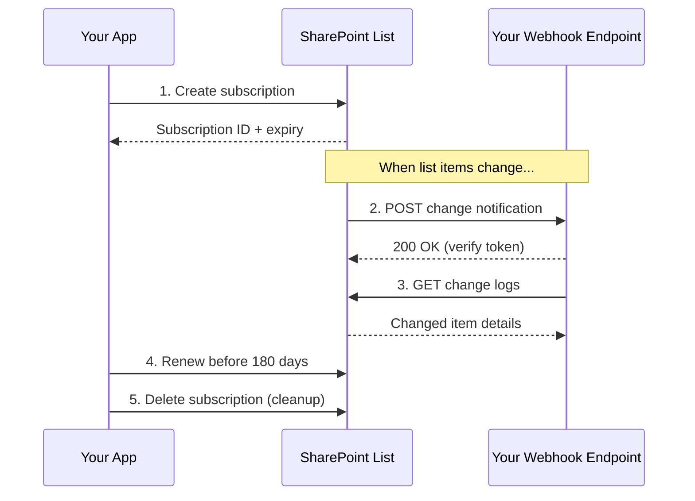

# SharePoint Webhook Subscriptions

Webhooks let your app receive HTTP callbacks when items change in a
SharePoint list. Subscriptions are scoped to a single list and expire
after 180 days.

---

## Prerequisites

| Requirement | Description | Reference |
|---|---|---|
| **Site Owner** role on the target list | Required to add, update, and remove webhook subscriptions. | [SharePoint admin roles](https://learn.microsoft.com/en-us/sharepoint/sharepoint-admin-role) |
| **Public HTTPS endpoint** | A publicly accessible URL that receives the POST notifications. | [Webhook notification format](https://learn.microsoft.com/en-us/sharepoint/dev/apis/webhooks/overview/sharepoint-webhooks#notification-format) |

---

## How webhooks work



---

## Examples

| Step | Operation | File | Required role | API reference |
|---|---|---|---|---|
| **1** | Add — subscribe to list change notifications | [`add_subscription.py`](./add_subscription.py) | Site Owner on list | [Create subscription](https://learn.microsoft.com/en-us/sharepoint/dev/apis/webhooks/overview/sharepoint-webhooks) |
| **2** | List — enumerate subscriptions on a list | [`get_subscriptions.py`](./get_subscriptions.py) | Read access | [List subscriptions](https://learn.microsoft.com/en-us/sharepoint/dev/apis/webhooks/overview/sharepoint-webhooks) |
| **3** | Renew — extend expiration date | [`set_expiration.py`](./set_expiration.py) | Site Owner on list | [Update subscription](https://learn.microsoft.com/en-us/sharepoint/dev/apis/webhooks/overview/sharepoint-webhooks) |
| **4** | Remove — unsubscribe from notifications | [`remove_subscription.py`](./remove_subscription.py) | Site Owner on list | [Delete subscription](https://learn.microsoft.com/en-us/sharepoint/dev/apis/webhooks/overview/sharepoint-webhooks) |

---

## Quick start

```python
from office365.sharepoint.client_context import ClientContext

ctx = ClientContext("https://contoso.sharepoint.com/sites/team").with_client_secret(
    "contoso.onmicrosoft.com", "client_id", "client_secret"
)

target_list = ctx.web.lists.get_by_title("Documents")

# Subscribe
sub = target_list.subscriptions.add(
    "https://your-app.azurewebsites.net/webhook/notifications"
).execute_query()
print(f"Subscribed: {sub.id} (expires: {sub.expiration_datetime})")
```

---

## API reference

- [SharePoint webhooks overview](https://learn.microsoft.com/en-us/sharepoint/dev/apis/webhooks/overview/sharepoint-webhooks)
- [SharePoint list webhooks reference](https://learn.microsoft.com/en-us/sharepoint/dev/apis/webhooks/overview/sharepoint-list-webhooks)