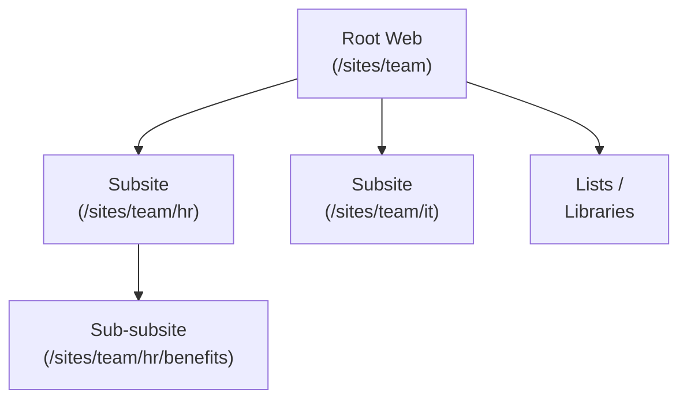

# Webs

A **web** (also called a site) is a SharePoint container for lists, libraries,
and pages. Every site has one root web and optionally many subsites.

---

## Prerequisites

| Requirement | Description | Reference |
|---|---|---|
| **Read access** to the web | Required to read properties and lists. **Site Owner** for configuration operations. | [SharePoint admin roles](https://learn.microsoft.com/en-us/sharepoint/sharepoint-admin-role) |

---

## How webs are structured



Every site has a root web. Webs can nest as subsites to form a hierarchy.
The current context's `web` property represents the site you're connected to.

---

## Examples

### Read

| Step | Operation | File | Required role | API reference |
|---|---|---|---|---|
| **1** | Get web properties | [`get_props.py`](./get_props.py) | Read access | [Webs REST API](https://learn.microsoft.com/en-us/sharepoint/dev/apis/rest-api) |
| **2** | Get all subsites | [`get_all.py`](./get_all.py) | Read access | [Webs REST API](https://learn.microsoft.com/en-us/sharepoint/dev/apis/rest-api) |
| **3** | Get lists in a web | [`get_lists.py`](./get_lists.py) | Read access | [Webs REST API](https://learn.microsoft.com/en-us/sharepoint/dev/apis/rest-api) |
| **4** | Get role definitions | [`get_roles.py`](./get_roles.py) | Read access | [Webs REST API](https://learn.microsoft.com/en-us/sharepoint/dev/apis/rest-api) |
| **5** | Get regional settings | [`get_regional_settings.py`](./get_regional_settings.py) | Read access | [Webs REST API](https://learn.microsoft.com/en-us/sharepoint/dev/apis/rest-api) |
| **6** | Get changes (change log) | [`get_changes.py`](./get_changes.py) | Read access | [Webs REST API](https://learn.microsoft.com/en-us/sharepoint/dev/apis/rest-api) |
| **7** | Get activities | [`get_activities.py`](./get_activities.py) | Read access | [Webs REST API](https://learn.microsoft.com/en-us/sharepoint/dev/apis/rest-api) |
| **8** | Get web from absolute URL | [`get_from_abs_url.py`](./get_from_abs_url.py) | Read access on target | [Webs REST API](https://learn.microsoft.com/en-us/sharepoint/dev/apis/rest-api) |

### Configure

| Step | Operation | File | Required role | API reference |
|---|---|---|---|---|
| **9** | Enable Document ID | [`enable_doc_id.py`](./enable_doc_id.py) | Site Owner | [Webs REST API](https://learn.microsoft.com/en-us/sharepoint/dev/apis/rest-api) |
| **10** | Clear a web (remove all content) | [`clear_web.py`](./clear_web.py) | Site Owner | [Webs REST API](https://learn.microsoft.com/en-us/sharepoint/dev/apis/rest-api) |

---

## Quick start

```python
from office365.sharepoint.client_context import ClientContext

ctx = ClientContext("https://contoso.sharepoint.com/sites/team").with_client_secret(
    "contoso.onmicrosoft.com", "client_id", "client_secret"
)

# Get web properties
web = ctx.web.get().execute_query()
print(f"Title: {web.title}, URL: {web.url}, Template: {web.get_web_template()}")
```

---

## API reference

- [SharePoint REST API](https://learn.microsoft.com/en-us/sharepoint/dev/apis/rest-api)
