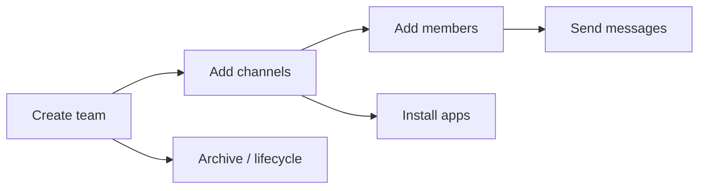

# Microsoft Teams

Examples for working with Microsoft Teams via the Graph API — creating
teams, managing channels, sending messages, adding members, and more.

---

## Prerequisites

| Requirement | Description | Reference |
|---|---|---|
| `Group.ReadWrite.All` (delegated) | Create teams and channels from groups | [Microsoft Graph permissions](https://learn.microsoft.com/en-us/graph/permissions-reference#group-permissions) |
| `Team.Create` (delegated) | Create new teams | [Microsoft Graph permissions](https://learn.microsoft.com/en-us/graph/permissions-reference#teams-permissions) |
| `Channel.Create` / `Channel.Delete.All` | Create and delete channels | [Microsoft Graph permissions](https://learn.microsoft.com/en-us/graph/permissions-reference#teams-permissions) |
| `ChannelMessage.Send` / `ChannelMessage.Read.All` | Send and read channel messages | [Microsoft Graph permissions](https://learn.microsoft.com/en-us/graph/permissions-reference#teams-permissions) |
| `TeamMember.ReadWrite.All` | Add and list team members | [Microsoft Graph permissions](https://learn.microsoft.com/en-us/graph/permissions-reference#teams-permissions) |
| `TeamsAppInstallation.ReadWriteForTeam.All` | Install and list apps | [Microsoft Graph permissions](https://learn.microsoft.com/en-us/graph/permissions-reference#teams-permissions) |

Admin consent is required for all permissions above.

---

## How Teams works



A **team** is backed by a Microsoft 365 group. Teams have **channels**
(topic-based conversations). Channels contain **messages** and can have
**tabs**, **apps**, and **members**.

---

## Examples

### Team lifecycle

| Step | Operation | File | Required role | API reference |
|---|---|---|---|---|
| **1** | Create a new team (async, waits for provisioning) | [`create_team.py`](./create_team.py) | `Team.Create` | [create team](https://learn.microsoft.com/en-us/graph/api/team-post) |
| **2** | Create a team from an existing Microsoft 365 group | [`create_from_group.py`](./create_from_group.py) | `Group.ReadWrite.All` | [team from group](https://learn.microsoft.com/en-us/graph/api/team-put-teams) |
| **3** | List all teams in the tenant | [`list_all.py`](./list_all.py) | `Team.ReadBasic.All` | [list all teams](https://learn.microsoft.com/en-us/graph/teams-list-all-teams) |
| **4** | List teams the signed-in user is a member of | [`list_my_teams.py`](./list_my_teams.py) | `Team.ReadBasic.All` | [joined teams](https://learn.microsoft.com/en-us/graph/api/user-list-joinedteams) |
| **5** | Archive a team (make read-only) | [`archive.py`](./archive.py) | `TeamSettings.ReadWrite.All` | [archive team](https://learn.microsoft.com/en-us/graph/api/team-archive) |

### Channels

| Step | Operation | File | Required role | API reference |
|---|---|---|---|---|
| **6** | Create a new public channel | [`channels/create.py`](./channels/create.py) | `Channel.Create` | [create channel](https://learn.microsoft.com/en-us/graph/api/channel-post) |
| **7** | List all channels in a team | [`channels/list.py`](./channels/list.py) | `Channel.ReadBasic.All` | [list channels](https://learn.microsoft.com/en-us/graph/api/channel-list) |
| **8** | Delete a non-default channel | [`channels/delete.py`](./channels/delete.py) | `Channel.Delete.All` | [delete channel](https://learn.microsoft.com/en-us/graph/api/channel-delete) |

### Messages

| Step | Operation | File | Required role | API reference |
|---|---|---|---|---|
| **9** | Send a message to the primary (General) channel | [`send_message.py`](./send_message.py) | `ChannelMessage.Send` | [send message](https://learn.microsoft.com/en-us/graph/api/chatmessage-post) |
| **10** | List messages in the primary channel | [`list_channel_messages.py`](./list_channel_messages.py) | `ChannelMessage.Read.All` | [list messages](https://learn.microsoft.com/en-us/graph/api/channel-list-messages) |
| **11** | Check user access to a shared channel | [`does_user_have_access.py`](./does_user_have_access.py) | `ChannelMember.Read.All` | [check access](https://learn.microsoft.com/en-us/graph/api/channel-doesuserhaveaccess) |

### Members

| Step | Operation | File | Required role | API reference |
|---|---|---|---|---|
| **12** | List all members of a team | [`members/list.py`](./members/list.py) | `TeamMember.Read.All` | [list members](https://learn.microsoft.com/en-us/graph/api/team-list-members) |
| **13** | Add a member to a team by email | [`members/add.py`](./members/add.py) | `TeamMember.ReadWrite.All` | [add member](https://learn.microsoft.com/en-us/graph/api/team-post-members) |

### Apps

| Step | Operation | File | Required role | API reference |
|---|---|---|---|---|
| **14** | List apps installed in a team | [`apps/list.py`](./apps/list.py) | `TeamsAppInstallation.Read.All` | [list apps](https://learn.microsoft.com/en-us/graph/api/team-list-installedapps) |
| **15** | Install an app from the catalog into a team | [`apps/install.py`](./apps/install.py) | `TeamsAppInstallation.ReadWriteForTeam.All` | [install app](https://learn.microsoft.com/en-us/graph/api/team-post-installedapps) |

---

## Quick start

```python
from office365.graph_client import GraphClient

client = GraphClient(tenant="contoso.onmicrosoft.com").with_client_secret(
    "client_id", "client_secret"
)

# List my teams
teams = client.me.joined_teams.get().execute_query()
for t in teams:
    print(f"{t.display_name}  ({t.web_url})")
```

---

## Official docs

- [Microsoft Teams API overview](https://learn.microsoft.com/en-us/graph/api/resources/team)
- [Channels overview](https://learn.microsoft.com/en-us/graph/api/resources/channel)
- [Chat messages overview](https://learn.microsoft.com/en-us/graph/api/resources/chatmessage)
- [Teams permissions](https://learn.microsoft.com/en-us/graph/permissions-reference#teams-permissions)
