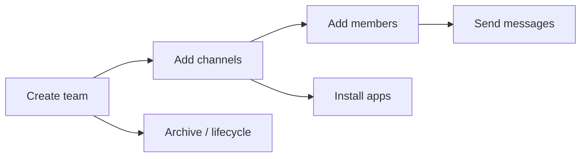

# Microsoft Teams

Examples for working with Microsoft Teams via the Graph API —
one basic scenario plus real-world admin, security, and management
patterns.

---

## Prerequisites

| Permission | Description | Reference |
|---|---|---|
| `Team.Create` (delegated) | Create new teams | [Microsoft Graph permissions](https://learn.microsoft.com/en-us/graph/permissions-reference#teams-permissions) |
| `Group.ReadWrite.All` (delegated) | Create teams and channels from groups | [Microsoft Graph permissions](https://learn.microsoft.com/en-us/graph/permissions-reference#group-permissions) |
| `TeamMember.ReadWrite.All` (delegated/application) | Add and remove team members | [Microsoft Graph permissions](https://learn.microsoft.com/en-us/graph/permissions-reference#teams-permissions) |
| `TeamsAppInstallation.ReadWriteForTeam.All` (delegated) | Install apps in a team | [Microsoft Graph permissions](https://learn.microsoft.com/en-us/graph/permissions-reference#teams-permissions) |
| `Chat.ReadWrite` (delegated) | Create and message in chats | [Microsoft Graph permissions](https://learn.microsoft.com/en-us/graph/permissions-reference#teams-permissions) |
| `TeamSettings.ReadWrite.All` (application) | Audit and remediate team settings | [Microsoft Graph permissions](https://learn.microsoft.com/en-us/graph/permissions-reference#teams-permissions) |
| `Directory.Read.All` (application) | Enumerate tenant-wide groups and deleted items | [Microsoft Graph permissions](https://learn.microsoft.com/en-us/graph/permissions-reference#directory-permissions) |

Admin consent is required for all permissions above.

---

## How Teams works



A **team** is backed by a Microsoft 365 group. Teams have **channels**
(topic-based conversations). Channels contain **messages** and can have
**tabs**, **apps**, and **members**.

**Chats** are separate from teams — they're direct 1-on-1 or group
conversations not tied to any team/channel.

---

## Basic usage

| Scenario | File | Permission | API reference |
|---|---|---|---|
| Create a team (async, auto-waits) | [`create_team.py`](./create_team.py) | `Team.Create` | [create team](https://learn.microsoft.com/en-us/graph/api/team-post) |

---

## Admin & management patterns

| Scenario | File | Why it's useful |
|---|---|---|
| **Tenant-wide team audit** — owners, member counts, visibility, archive status, guests | [`audit_teams_overview.py`](./audit_teams_overview.py) | The #1 admin ask: "who owns what, who's in it, is it live?" Uses Groups OData filter for tenant-wide enumeration |
| **Settings governance** — scan all teams against a policy baseline and report violations | [`audit_team_settings.py`](./audit_team_settings.py) | Enforce Giphy/stickers policy, restrict guest channel creation, lock down messaging. Includes commented-out auto-remediation |
| **Lifecycle report** — active, archived, and recently deleted teams with restore windows | [`audit_lifecycle.py`](./audit_lifecycle.py) | Track what's been archived/deleted and for how long — essential for cleanup and compliance |
| **Guest access audit** — find every team containing external guest users | [`audit_guest_access.py`](./audit_guest_access.py) | Security audit — identifies shadow collaboration with external users across the org |
| **Provision channels from template** — batch create channels with descriptions | [`channels/provision.py`](./channels/provision.py) | Bootstrap a new team with a standard channel structure. Skips existing channels, idempotent |
| Create a team from an existing M365 group (async with retry callback) | [`create_from_group.py`](./create_from_group.py) | Group→team provisioning is async; shows `execute_query_retry` with a progress callback |
| Add a member to a team by email (with role assignment) | [`members/add.py`](./members/add.py) | Cross-object user resolution + `members.add()` with roles |
| Remove a member from a team by email | [`members/remove.py`](./members/remove.py) | Reverse of add — requires application permission |
| Install a Teams app from the catalog into a team | [`apps/install.py`](./apps/install.py) | Two-step flow: query catalog → install into team |
| Create a 1-on-1 chat and send a message | [`chats/create_and_message.py`](./chats/create_and_message.py) | Multi-step flow: resolve users → create chat → send message |
| **Usage report** — team counts and user activity over D7/D30/D90 | [`reports/usage.py`](./reports/usage.py) | Adoption tracking, chargeback, and inactivity detection across multiple time windows |

---

## Full coverage map

| Category | Example |
|---|---|
| **CRUD** | Create team, provision channels, add/remove members |
| **Provisioning** | Group→team async, batch channel template |
| **Apps** | Catalog install |
| **Chats** | 1-on-1 create + message |
| **Audit** | Tenant overview (owners, members, visibility, archived, guests) |
| **Governance** | Settings baseline scan + auto-remediate |
| **Lifecycle** | Active vs archived vs deleted teams |
| **Security** | Guest user detection across all teams |

---

## Quick start

```python
from office365.graph_client import GraphClient

client = GraphClient(tenant="contoso.onmicrosoft.com").with_client_secret(
    "client_id", "client_secret"
)

# List teams I'm a member of
teams = client.me.joined_teams.get().execute_query()
for t in teams:
    print(f"{t.display_name}  ({t.web_url})")
```

---

## Official docs

- [Microsoft Teams API overview](https://learn.microsoft.com/en-us/graph/api/resources/team)
- [Channels overview](https://learn.microsoft.com/en-us/graph/api/resources/channel)
- [Chat messages overview](https://learn.microsoft.com/en-us/graph/api/resources/chatmessage)
- [Chat overview](https://learn.microsoft.com/en-us/graph/api/resources/chat)
- [List all teams](https://learn.microsoft.com/en-us/graph/teams-list-all-teams)
- [Deleted items](https://learn.microsoft.com/en-us/graph/api/directory-deleteditems-list)
- [Teams permissions](https://learn.microsoft.com/en-us/graph/permissions-reference#teams-permissions)
